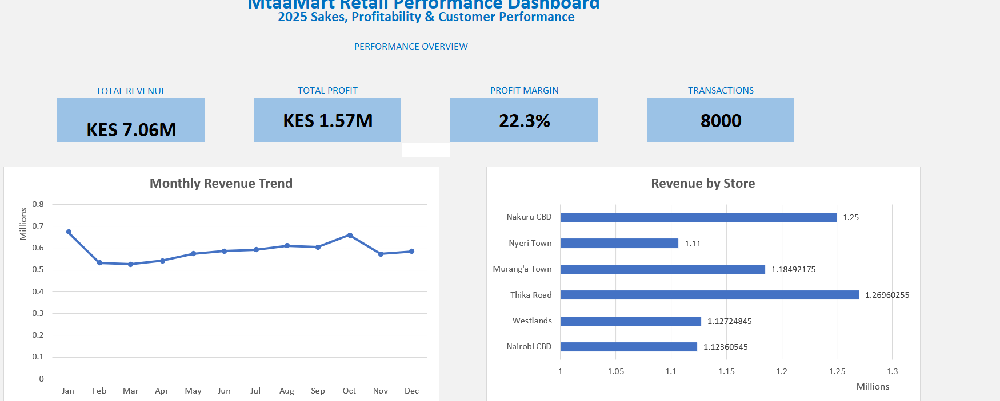
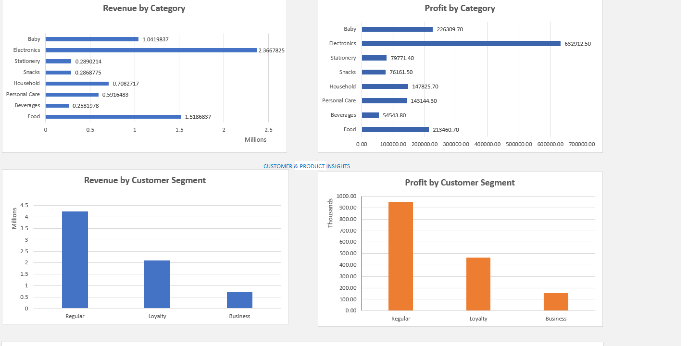
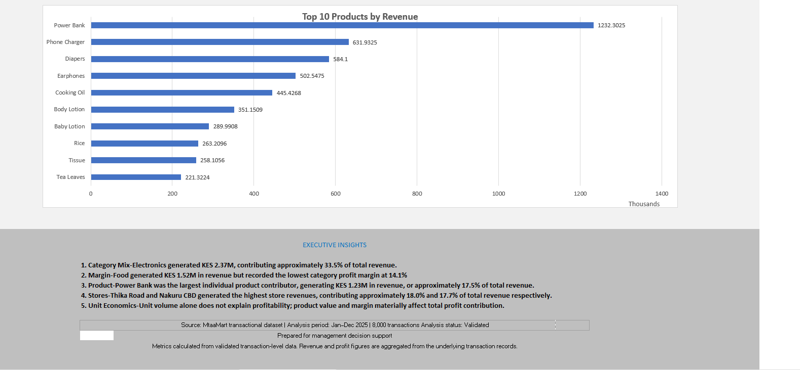

# MtaaMart Retail Performance Analysis

### End-to-End Retail Sales, Profitability & Customer Analytics in Microsoft Excel

 A real-world retail analytics project transforming 8,000 transaction records into validated business insights, management recommendations and an executive dashboard.

## 📊 Dashboard Preview

## 📊 Project Overview

MtaaMart Retail Performance Analysis is an end-to-end Microsoft Excel analytics project designed to evaluate sales performance, profitability, customer segments, store performance and product contribution across 8,000 retail transactions.

The project transforms transaction-level data into validated business metrics, analytical summaries and an executive dashboard designed to support data-driven management decisions.

## 🎯 Business Problem

MtaaMart needed a consolidated view of its retail performance to understand where revenue and profit were being generated, how stores and product categories were performing, and which products and customer segments were contributing most to overall business results.

The analysis was designed to answer key questions around revenue trends, store performance, category profitability, product contribution and customer behavior.
## 🔍 Project Objectives

- Measure overall revenue and profitability
- Identify monthly revenue trends
- Compare performance across six stores
- Evaluate revenue and profit by product category
- Identify the highest-revenue products
- Analyze customer segment contribution
- Validate transaction-level data before reporting
- Develop an executive-level Excel dashboard
- Translate findings into data-driven management recommendations

  ## 📁 Dataset

| Metric | Value |
|---|---:|
| Transactions | 8,000 |
| Products | 30 |
| Stores | 6 |
| Categories | 8 |
| Units Sold | 23,920 |
| Analysis Period | Jan–Dec 2025 |
| Total Revenue | KES 7.06M |
| Total Profit | KES 1.57M |

## 🧪 Data Quality & Validation

Before analysis and visualization, the transaction-level dataset was validated for:

- Transaction completeness
- Missing products
- Missing stores
- Negative profit records
- Month-label consistency
- Reconciliation of revenue, profit, units and transactions

During validation, six months contained the month label `Sept` instead of the standardized `Sep`. The inconsistency was identified and corrected before the final analysis.

After correction, the dataset reconciled to 8,000 transactions and KES 7.06M in total revenue.

## 📈 Key Results

| KPI | Result |
|---|---:|
| Total Revenue | **KES 7.06M** |
| Total Profit | **KES 1.57M** |
| Profit Margin | **22.3%** |
| Units Sold | **23,920** |
| Transactions | **8,000** |
| Average Transaction Value | **KES 882.68** |
| Total Discounts | **KES 184,113.40** |

## 💡 Key Findings

### Electronics leads revenue contribution

Electronics generated approximately **KES 2.37M**, contributing about **33.5% of total revenue** while maintaining a **26.7% profit margin**.

### Food generates volume but has weaker margins

Food generated approximately **KES 1.52M in revenue**, but recorded the lowest category profit margin at **14.1%**.

### Power Bank is a major individual contributor

Power Bank generated approximately **KES 1.23M**, representing about **17.5% of total revenue**, with a **26.8% profit margin**.

### Store performance

Thika Road and Nakuru CBD recorded the highest store revenues at approximately **KES 1.27M** and **KES 1.25M**, respectively.

### Volume does not equal profitability

Products with similar unit volumes can generate substantially different profit contributions, highlighting the importance of evaluating revenue, margin and profit together.
## 🧭 Management Recommendations

1. **Protect high-contribution electronics products**
   
   Monitor availability, stock-outs, reorder levels and margins for key electronics products.

2. **Review Food category margins**
   
   Investigate pricing, supplier costs, discounts and product mix for lower-margin food products.

3. **Monitor Power Bank inventory concentration**
   
   Maintain availability while monitoring the business exposure created by a single high-contribution product.

4. **Use store-level performance to guide inventory allocation**
   
   Combine store and product-level analysis to improve replenishment decisions.

5. **Balance sales volume with profitability**
   
   Evaluate products using units, revenue, margin and profit contribution rather than volume alone.

6. **Establish recurring performance monitoring**
   
   Refresh the dashboard regularly to track changes in revenue, profit, margins, stores, categories and products.

   ## 🛠️ Tools & Skills Demonstrated

**Microsoft Excel**

- Data cleaning and validation
- Excel Tables
- Structured references
- `SUMIFS`
- `COUNTIFS`
- `INDEX`
- `ROWS`
- `SORTBY`
- `TAKE`
- KPI development
- Business analysis
- Data visualization
- Dashboard design
- Executive reporting
- Data-driven recommendations

## 🔄 Analytical Workflow

Raw Transaction Data 
↓  
Data Validation  
↓  
Data Cleaning  
↓  
KPI Development  
↓  
Store Analysis  
↓  
Category Analysis  
↓  
Product Analysis  
↓  
Customer Analysis  
↓  
Visualization  
↓  
Executive Dashboard  
↓  
Business Insights  
↓  
Management Recommendations

## 📂 Project File

[Download the complete Excel analysis](./MtaaMart_Retail_Performance_Analysis.xlsx)

## ⚠️ Limitations & Future Analysis

The current analysis does not establish:

- Customer retention over time
- Inventory turnover or stock-outs
- Supplier cost trends
- Product performance by individual store
- Marketing campaign effectiveness
- Year-over-year growth

Future analysis could extend the project into:

- Store × Product performance
- Customer cohort analysis
- Inventory analytics
- Discount effectiveness
- Multi-year trend analysis

  ---

## 👤 Author

**Nicholus Maingi Mwanthi**

Data Analyst | ICT Support | Data Engineer

This project was developed as part of my professional data analytics portfolio.

---

⭐ If you find this project useful, feel free to explore the workbook and analysis.
